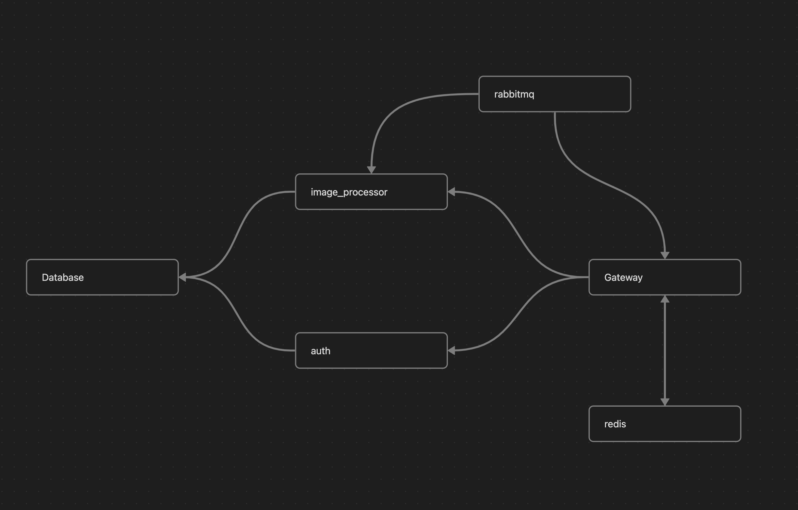

# Тестовое задание для компании "Аболъ"

### Архитектура проекта



### Установка

Установка проекта обёрнутого в докер

```bash
git clone git@github.com:Leraner/test_task_abol.git
```

### Запуск

```bash
docker-compose up --build
```

### Запуск тестов

```bash
cd image_processor
pytest tests/images_tests.py
```